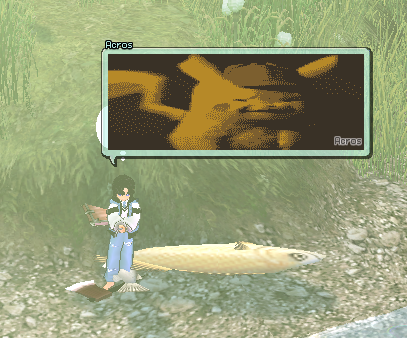

# Mabinogi Visual Chat Converter
A converter for images to Mabinogi Visual Chat format written in PHP
 
## Requirements
You will need PHP, gd extension for PHP, and the Command-line binary for [pngquant](https://pngquant.org). 

## Usage

POST to mabivcc.php with two images using mabiVc and newImage. 
A [default Visual Chat image](https://github.com/ryuugana/mabi-vcc/blob/main/temporary.png) will be used if mabiVc is not provided. 
The new Visual Chat will be downloaded as a PNG when the conversion has completed. 
A basic example can be found in the [demo](https://github.com/ryuugana/mabi-vcc/blob/main/mabivcc.html). 
In order to use the [demo](https://github.com/ryuugana/mabi-vcc/blob/main/mabivcc.html) make sure mabivcc.php, mabivcc.html, and temporary.png are in the same directory. 
Another example is this [website](http://mabiv.cc) which uses mabi-vcc.

## Preview from in game

